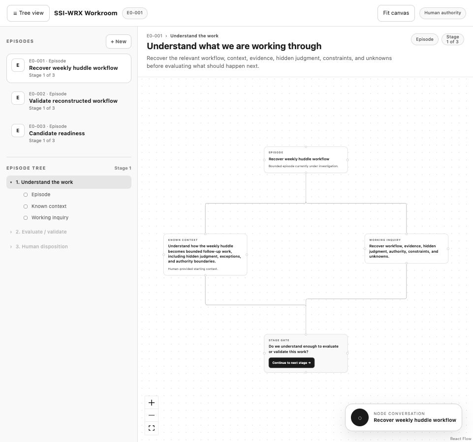

# SSI-WRX WebMCP Workroom

SSI-WRX Workroom is a local-first decision workflow for making evidence, agent reasoning, human questions, and final human disposition visible in one place. It is a Vite + React single-page application with a React Flow workflow canvas, browser-local persistence, and an optional loopback Codex runtime for bounded read-only analysis.

## Preview



The `assets/` folder also includes captures of the new-episode dialog and a second sample episode view.

## What the workroom does

The workroom organizes work into **episodes**. An episode is a bounded piece of work that moves through three stages:

1. **Understand the work** — capture the episode, relevant context, workflow, evidence, hidden judgment, authority boundaries, constraints, and unknowns.
2. **Evaluate / validate** — inspect evidence, gaps, conflicts, risks, and agent recommendations before human review.
3. **Human disposition** — a human reviews the retained work and chooses what happens next.

Agents can add inspectable evidence, recommendations, evaluations, source-backed findings, and conversation responses for a human. They cannot accept workflow structure, advance an episode, record final disposition, send external communications, edit files, use the web, or invoke external tools. Stage movement and final decisions remain human-owned UI actions.

## Main UI concepts

- **Episode sidebar** — switch between episodes or create a new one.
- **Episode tree and cockpit** — navigate unlocked stages, see the next human action, pending prompts, retained outputs, source counts, Autopilot status, and targeted orchestration status.
- **React Flow canvas** — inspect the current stage, drag nodes, organize Stage 1 with a left-to-right dependency layout, follow active work, trace upstream/downstream dependencies, and see durable evidence/branch edges.
- **Node conversations** — ask questions attached to a node, attach source files to a conversation, stream local Codex responses, retry or cancel a response, and retain the conversation as an inspectable thread.
- **Source library and viewer** — inspect locally stored transcript/context files and extracted text from the context drawer or episode cockpit.
- **Stage gates and human checkpoints** — advance the active episode manually when justified. Accepted intake checkpoints remain separate gates with their original titles and dependencies.
- **Human disposition** — record the final human-owned outcome from the last stage.
- **Targeted node orchestration** — create a deterministic preview for an eligible accepted node, explicitly approve a maximum-three-turn read-only run, stream specialist task state, cancel it, and inspect resulting artifacts.
- **Autopilot Episode Runs** — consented agent-assisted episodes automatically run one bounded maximum-five-turn pipeline: intake planner, up to three dependency-aware specialists, and final synthesis/review. The draft plan remains unaccepted and the final package always requires human review.
- **Source-informed Episode creation** — paste transcript/context and attach up to 10 `.txt`, `.md`, `.pdf`, or `.docx` files (10 MB each). Text is extracted in the browser, originals and full extracted text stay in IndexedDB, and only source metadata is kept in the Episode's localStorage record. Explicit consent is required before source text is sent to the local Codex runtime.
- **Activity and notifications** — review human, Codex, source, proposal, orchestration, Autopilot, failure, and completion events, with related-work links and dismissible agent notifications.

“First Mate” remains a planning/display role for targeted node orchestration. Autopilot and node orchestration use only the loopback runtime with read-only sandboxing, disabled approvals, disabled network access, and disabled web search. Private model reasoning is not displayed; only safe activity labels and validated structured outputs are shown.

## WebMCP tools

The app registers tools through [`use-webmcp-tool`](https://github.com/GoogleChromeLabs/use-webmcp-tool). In a browser that supports WebMCP, an agent can discover and call these tools through `document.modelContext`:

| Tool | Purpose | Mutates workroom state? |
| --- | --- | --- |
| `list_episodes` | List episode IDs, titles, stages, status, and disposition | No |
| `get_episode` | Inspect an episode, its current core nodes, branches, and disposition | No |
| `get_node_thread` | Read the complete history for a node thread | No |
| `get_pending_node_prompts` | Find pending human questions and their conversation history | No |
| `respond_to_node_prompt` | Append an agent response to a pending thread | Yes |
| `add_evidence` | Add an evidence branch to the active or selected episode | Yes |
| `propose_action` | Add an agent recommendation and reasoning branch | Yes |
| `evaluate_proposal` | Add an evaluation branch with verdict, confidence, conflicts, risks, and missing evidence | Yes |

The read-only tools are marked with `readOnlyHint: true`. Write tools only add or answer inspectable branches; they do not advance stages or make the final human decision.

## Data model and persistence

Episode data is stored in the browser under the `localStorage` key `ssi-wrx-workroom-v4`. The stored collection contains:

- episode metadata: `id`, `title`, `context`, `currentStage`, `status`, and `disposition`;
- saved node positions in `layouts`; and
- agent or human additions in `additions`, including evidence, proposals, evaluations, and threaded conversations.

The workroom remains local-first: there is no database, authentication, multi-user sync, or remote persistence. Source originals and full extracted text are stored in the browser's IndexedDB under source IDs; the episode's existing localStorage record stores only a source manifest. Deleting an Episode removes its associated IndexedDB sources. The local Codex runtime is a loopback-only HTTP/SSE adapter for intake, node conversations, node orchestration, and bounded Autopilot runs; it does not persist episode or source text and retains only a bounded, short-lived in-memory run history. Episode data is specific to the current browser profile and origin. The app loads bundled example episodes when no saved data exists and includes compatibility loading for older `v3` and `ssi-wrx-multi-episode-v1` storage keys.

Agent-assisted intake produces a proposal only. Source preparation generates bounded per-source summaries and a combined context package before the existing proposal pass; source-informed work nodes cite the source IDs they rely on. Human checkpoints are retained as explicit workflow gate records with their titles and dependencies when a human accepts the proposal. Humans remain solely responsible for accepting structure, advancing stages, and recording final disposition.

Autopilot adds an episode-local `autopilotRun` record to compatible episodes. It stores run metadata, draft plan, task states, bounded outputs, assumptions, unresolved questions, errors, final package, and human review status in localStorage. Source text is loaded from IndexedDB only for the active run and is never retained by the server. Promotion of a final package updates trusted context only; it does not accept workflow structure, advance a stage, or record disposition. Revised runs are explicit human actions and are never retried automatically. Run history on the server is short-lived and bounded; it is not a persistence layer.

## Getting started

### Requirements

- Node.js with npm
- A modern browser; WebMCP features require a browser or agent integration that supports the WebMCP API

### Install dependencies

```bash
npm install
```

### Start the development server

```bash
npm run dev
```

Vite will print the local URL, normally `http://localhost:5173`.

### Initialize the workroom and open the browser

For the usual next-start workflow, run:

```bash
npm run initialize
```

This starts Vite on `http://localhost:5173/` and the local Codex runtime on `http://127.0.0.1:8787`, waits for both services to respond, and opens the workroom in the system browser. Keep that terminal open while working; press `Ctrl+C` to stop both processes cleanly. The runtime checks local Codex status and exposes read-only intake, node conversation, targeted orchestration, and Autopilot SSE endpoints; it requires a local Codex CLI login for analysis. Source text is sent only after the user explicitly consents in the modal. Agent-assisted creation shows a maximum-five-turn guard and starts one bounded Autopilot run after consent.

### Other commands

```bash
npm run build    # Create a production build in dist/
npm run preview  # Serve the production build locally
npm run lint     # Run Oxlint
npm run test:intake # Run all lightweight node:test coverage
npm run initialize # Start Vite and open the workroom in the browser
```

The test script currently covers intake graph/checkpoint validation, source extraction fixtures, targeted orchestration, Autopilot scheduling/state/output contracts, and planner Episode-ID validation.

## Project structure

```text
.
├── src/
│   ├── App.jsx              # Workflow model, UI, persistence, runtime clients, and WebMCP tools
│   ├── episodeIntake.js     # Intake schema, proposal validation, and checkpoint graph helpers
│   ├── episodeSources.js     # Browser extraction, source manifest, and IndexedDB helpers
│   ├── orchestration.js     # Deterministic targeted node orchestration planning contract
│   ├── autopilot.js         # Five-turn scheduling, state, output, and authority contracts
│   ├── workflowLayout.js    # Dagre layout and dependency trace helpers
│   ├── App.css              # Workroom and React Flow styling
│   ├── NewEpisodeModal.jsx  # New episode form
│   ├── NewEpisodemodal.css  # New episode modal styles
│   ├── index.css             # Global styles and theme variables
│   └── main.jsx              # React entry point
├── public/                  # Static icons and favicon
├── index.html               # HTML shell and document title
├── vite.config.js            # Vite React configuration
├── server/                   # Loopback Codex runtime and SSE run endpoints
├── scripts/initialize.mjs    # Starts/stops Vite and the local runtime
├── test/                     # Lightweight node:test coverage
└── package.json              # Scripts and dependencies
```

## Development notes

- `EPISODE_STAGES` in `src/App.jsx` is the source of truth for the three stage names, descriptions, core nodes, and base edges.
- Episode updates are kept in React state and serialized to `localStorage` after changes.
- React Flow node positions are saved per episode and stage when a node is dragged. Automatic Stage 1 layout runs only when workflow positions are absent; the Organize workflow action intentionally recomputes and saves them.
- `src/workflowLayout.js` uses Dagre for left-to-right Stage 1 layout and computes upstream/downstream trace sets. Manual positions always win until the human explicitly organizes the workflow.
- IDs for new episodes and additions are generated in the browser. New episodes use the next `E0-###` number; branch and thread IDs use UUIDs.
- Source metadata is persisted in the episode; original files and complete extracted text remain in IndexedDB. Generated outputs are durable additions attached to workflow nodes and can be inspected or exported as Markdown review files.
- The app intentionally keeps agent contributions separate from human disposition so the workflow remains inspectable and human-controlled.

## Current scope

This repository is a local-first workroom/prototype. It does not provide multi-user synchronization, server-side episode persistence, account management, automated stage advancement, external communications, remote deployment, authentication, file editing, browser actions, web access, or external tool execution. The local Codex runtime is limited to read-only intake, bounded node analysis, and bounded Autopilot proposal/final-package streaming; it does not accept structure, execute operational work, advance the workflow, or record disposition. Autopilot is not exposed as a WebMCP action.
